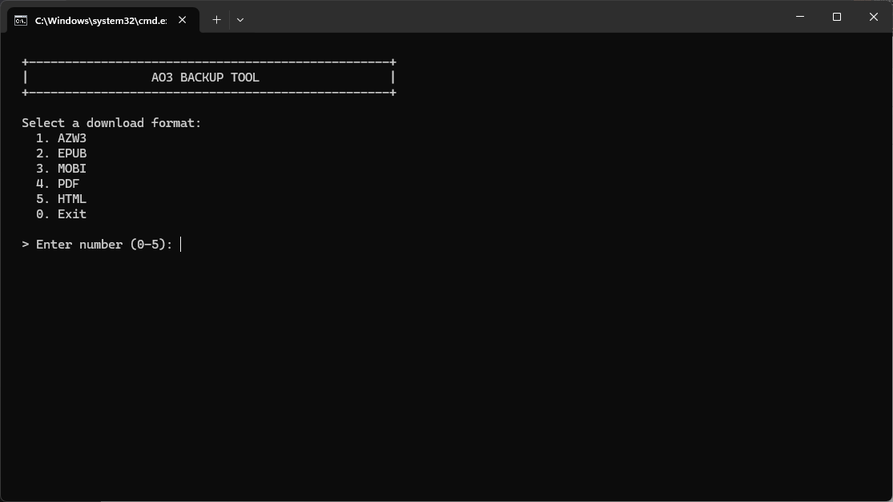

# AO3 Backup Tool

AO3 Backup Tool is a lightweight, zero-dependency Python script that automates the retrieval of entire fanfiction works from Archive of Our Own (AO3) via the site's direct download endpoint.

This project is unofficial and is not affiliated with Archive of Our Own or the Organization for Transformative Works.

## Video Tutorial

[Watch the step-by-step usage guide on YouTube](https://www.youtube.com/watch?v=XYoOpuPYPIo)

*(Note: The video also includes a complete guide on how to download and install Python for Windows x64 directly from python.org).*

The tutorial uses real AO3 data for an objective demonstration:

- Work
  + Work 1: [Người Không Bao Giờ Chạm Tới Bình Minh](https://archiveofourown.org/works/69719781)
  + Work 2: [From You, A Whisper of Hope](https://archiveofourown.org/works/68383601)
  + Work 3: [The Blazing Sun That Dreams of Coffee](https://archiveofourown.org/works/74057676)
- Author
  + Author 1: [Duongmotchieu (ineedsleepzzz)](https://archiveofourown.org/users/ineedsleepzzz/pseuds/Duongmotchieu)
  + Author 2: [VanToRia](https://archiveofourown.org/users/VanToRia/pseuds/VanToRia)
  + Author 3: [Infiniti_Ophis](https://archiveofourown.org/users/Infiniti_Ophis/pseuds/Infiniti_Ophis)

The referenced work, author profile, and series belong to their respective AO3 creator.

## Screenshots

Screenshots use fictional demo data for display purposes only. They do not contain real AO3 usernames, work titles, or relationships.

  

## Features

- **Batch Downloading:** Process hundreds of fanfictions automatically from a simple text list. The tool always downloads the **entire work**, even if you provide a URL pointing to a specific chapter.
- **Continuous Mode & Logging:** Runs in an infinite loop, allowing multiple consecutive batch downloads. Automatically clears the screen between sessions and saves a detailed console log to the `logs/` directory.
- **Smart Metadata Extraction:** Scrapes the work's HTML page to construct accurate, untruncated `Title - Author` filenames instead of relying on default server naming conventions.
- **DDoS Protection & Cloudflare Bypass:** Implements strict, configurable inter-request delays and HTTP header spoofing to ensure your IP address remains unflagged.
- **Intelligent Deduplication:** Scans the output directory before downloading. Existing files are skipped to save bandwidth, while maintaining pacing delays to mimic human browsing behavior.
- **OS-Safe Sanitization:** Automatically strips illegal characters and blocks Windows reserved filenames (e.g., `CON`, `PRN`) to prevent OS-level crashes.
- **Zero External Dependencies:** Built entirely on the Python 3.10+ Standard Library. No virtual environments or `pip install` commands required.

## Files

- `ao3_backup_tool.py` - The core Python script.
- `run.bat` - Windows batch launcher for seamless execution and environment validation.
- `list.txt` - The input manifest for specifying target work IDs or URLs.

## How It Works

The tool processes each entry in two phases to guarantee accuracy and network safety:

1. **Metadata Phase:** The script sends an initial request to the AO3 work page using spoofed `User-Agent` and `Referer` headers. It parses the HTML DOM using Regular Expressions to extract the exact title and author byline, which are then sanitized to form the destination filename.
2. **Download Phase:** After an initial `METADATA_DELAY_SECONDS` cooldown, the script checks if the target file (e.g., `.epub` or `.pdf`) already exists locally. If not found, it requests the file from the `download.archiveofourown.org` endpoint. If the initial metadata phase failed due to a network timeout, the tool automatically falls back to extracting the filename from the HTTP `Content-Disposition` header provided by the download server.

Finally, the tool forces a `DOWNLOAD_DELAY_SECONDS` cooldown before processing the next entry in the list, neutralizing the risk of triggering AO3's anti-bot defenses.

## Usage

1. Ensure **Python 3.10** (or later) is installed on your machine and added to your system PATH.
2. Open `list.txt` and populate it with target works. You can use bare IDs, chapter URLs, or full URLs (one per line).
3. Execute the tool:
   - **Windows:** Double-click `run.bat`.
   - **macOS / Linux:** Run `python ao3_backup_tool.py` in your terminal.
4. Select your desired output format from the interactive console menu (AZW3, EPUB, MOBI, PDF, HTML).
5. Downloaded files will be automatically saved to the `works/` subdirectory.

## Troubleshooting

**Windows Defender SmartScreen / Smart App Control blocked the script?**

When you download a `.zip` or `.bat` file from the internet, Windows tags it with a security flag ("Mark of the Web"). To fix this:
1. **Before extracting**, right-click the downloaded `.zip` file.
2. Select **Properties**.
3. At the bottom of the *General* tab, check the **Unblock** box.
4. Click **Apply**, then **OK**.
5. Extract the `.zip` file. You can now double-click `run.bat` without being blocked.

## Configuration

Core variables can be tweaked at the top of the `ao3_backup_tool.py` file:

- `METADATA_DELAY_SECONDS`: Cooldown after fetching the HTML page. (Default: `3`)
- `DOWNLOAD_DELAY_SECONDS`: Cooldown after attempting or skipping a download. (Default: `7`)
- `CHROME_VERSION`: The Chrome major version used to spoof the User-Agent string. (Default: `150`)

*Note: Decreasing the delay variables below their defaults drastically increases the risk of being temporarily IP-banned by Cloudflare.*

## Privacy & Security

This tool operates entirely locally on your machine. It does not collect telemetry, route traffic through proxies, or require your AO3 login credentials. Consequently, it can only download works that are available to the public (non-locked works).

For full details, please review `PRIVACY.md`.

## Acknowledgements

This project was implemented based on the ideas and concepts provided by the admin of **It's all about your OTPs**. 

Special thanks to their insightful guide: ["Hướng dẫn tải fanfic trong trường hợp AO3 sập hoặc bảo trì"](https://www.facebook.com/VerifiedFulltimeFangirl/posts/pfbid034t1WxSuSj3wz7B4KNPNsZLt8US5EAqokkibaTAgiKepAjmoSz2tZ6qhEuCTm5wfCl), which served as the conceptual foundation for interacting with the AO3 download endpoint.

My deepest thanks also go to the friends and beta testers from the PhaiRice shipper community (fans of the Phainon x Castorice pairing in miHoYo's *Honkai: Star Rail*). Your support, testing, and suggestions helped shape this project from a small personal tool into something worth sharing.

## License & Notices

**AO3 Backup Tool** is open-source software licensed under the **GNU Affero General Public License v3.0 (AGPL-3.0-only)**. 

- See `NOTICE.md` for copyright, fair use, and unofficial-project disclaimers.
- See `PRIVACY.md` for our strict zero-telemetry privacy guarantee.
